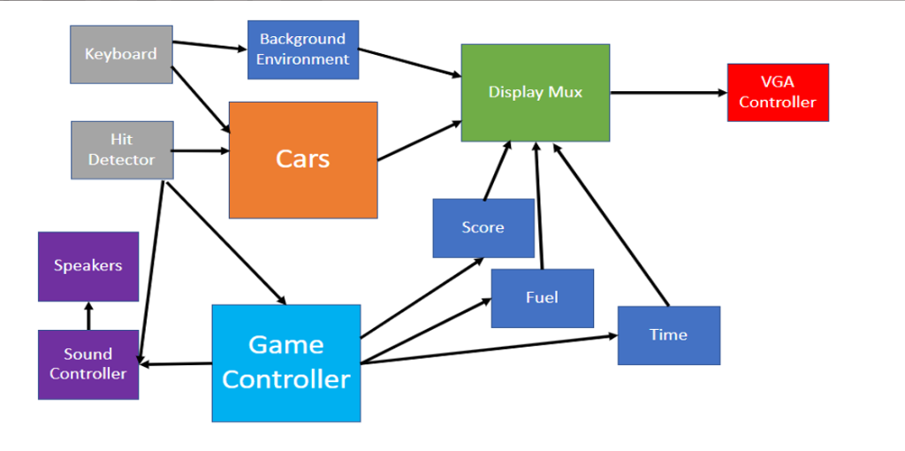
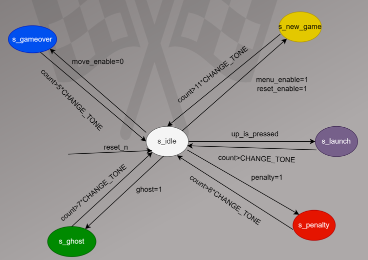
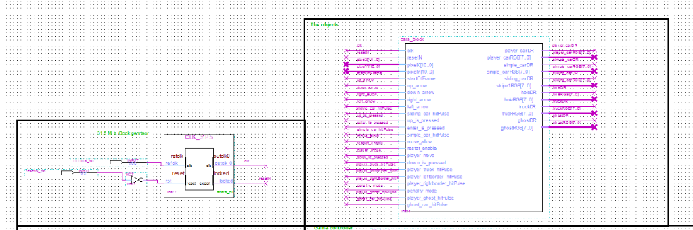
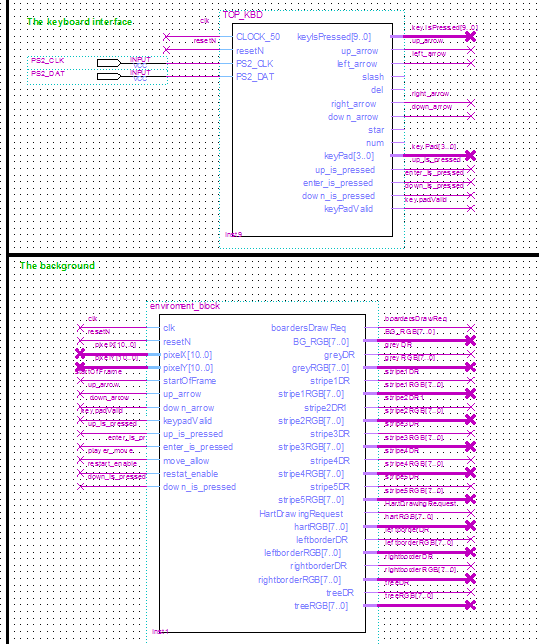
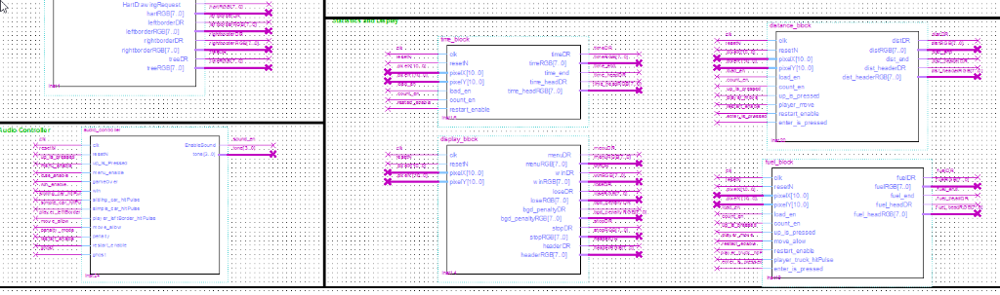
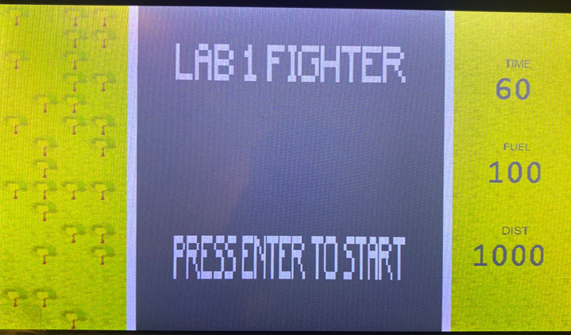
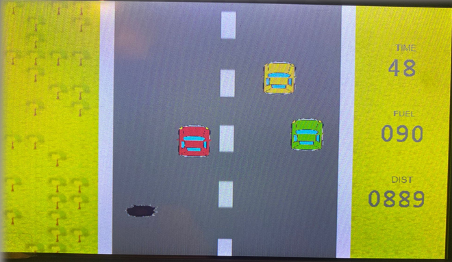
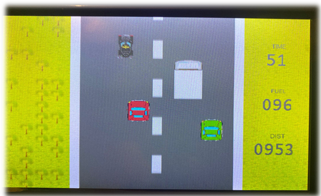
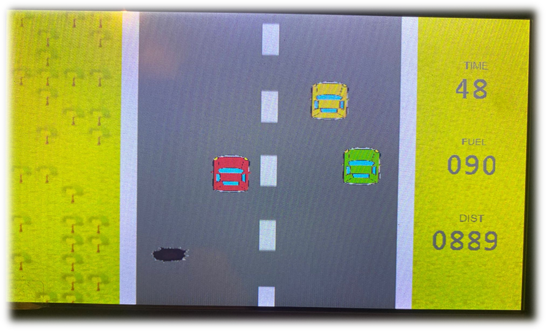

# 🏎️ Road Fighter NES - FPGA Recreation

A hardware implementation of the classic 1984 NES arcade racing game **Road Fighter**, recreated on an FPGA using SystemVerilog and Verilog. This project was developed as part of an ECE (Electrical and Computer Engineering) lab course, featuring custom modifications and enhanced gameplay features.

---

## 📖 Overview

Road Fighter is a classic vertical-scrolling racing video game originally developed by Konami for the Nintendo Entertainment System (NES). The objective is to drive a race car through various stages, avoiding obstacles and other vehicles while managing fuel consumption.

This FPGA-based recreation brings the nostalgic gameplay experience to modern hardware, implementing the game logic entirely in hardware description languages (HDL) and running on the DE10-Standard FPGA development kit.

### About the Original Game
The original Road Fighter (1984) was one of Konami's early racing games, featuring:
- Vertical scrolling road perspective
- Obstacle avoidance gameplay
- Fuel management mechanics
- Multiple vehicle types as obstacles

---

## ✨ Features

- **Classic Gameplay** - Faithful recreation of the original Road Fighter experience
- **Vertical Scrolling Road** - Smooth road animation with proper perspective
- **Multiple Obstacle Types**:
  - Trucks
  - Other cars (ghost cars)
  - Road holes
  - Trees
- **Fuel System** - Manage your fuel to reach the destination
- **Distance Counter** - Track your progress through the course
- **Win/Lose Conditions** - Complete the distance or run out of fuel
- **Menu System** - Start screen with game options
- **VGA Display Output** - Real-time graphics rendering
- **Hardware-Based Implementation** - Pure HDL design, no software/processor

---

## 🔧 Hardware Requirements

| Component | Specification |
|-----------|---------------|
| **FPGA Board** | DE10-Standard (Terasic) |
| **FPGA Chip** | Intel Cyclone V 5CSXFC6D6F31C6N |
| **Display** | VGA-compatible monitor |
| **Input** | On-board buttons/switches or external controller |
| **Power** | Standard DE10 power supply |

### DE10-Standard Features Used
- On-chip memory for graphics/bitmaps
- PLL for clock generation (31.5 MHz for VGA)
- GPIO for VGA output
- User buttons for game controls

---

## 📁 Project Structure

```
Road_Fighter_NES/
├── README.md                 # This file
├── .gitignore               # Git ignore rules
├── src/                     # Source code files
│   ├── *.sv                 # SystemVerilog modules
│   └── *.v                  # Verilog modules
├── design/                  # Block design files
│   └── *.bdf                # Quartus Block Design Files
├── ip/                      # IP cores and generated files
│   ├── CLK_31P5.*          # Clock PLL IP files
│   └── Number_position.*   # Number display IP files
├── constraints/             # Timing and pin constraints
│   └── DE10_Standard_Audio.sdc
├── project/                 # Quartus project files
│   ├── Lab1Demo.qpf        # Project file
│   ├── Lab1Demo.qsf        # Settings file
│   └── *.qdf               # Assignment defaults
└── docs/                    # Documentation and assets
    └── in_game.png         # Game screenshot
```

### Source Modules (`src/`)

| Module | Description |
|--------|-------------|
| `distance_counter.sv` | Tracks player distance/progress |
| `distance_digit.sv` | Displays distance digits |
| `hole_move.sv` | Controls hole obstacle movement |
| `tree_move.sv` | Controls tree obstacle movement |
| `truck_move.sv` | Controls truck obstacle movement |
| `*BitMap.sv` | Sprite/graphics bitmap modules |
| `matrix_top_xy.v` | Top-level display matrix |
| `CLK_31P5.v` | 31.5 MHz clock generator for VGA |
| `Number_position.v` | Number display positioning |

### Block Designs (`design/`)

| Block | Description |
|-------|-------------|
| `player_car_block.bdf` | Player vehicle control |
| `cars_block.bdf` | Enemy car management |
| `truck_block.bdf` | Truck obstacle handling |
| `ghost_block.bdf` | Ghost car behavior |
| `hole_block.bdf` | Road hole obstacles |
| `display_block.bdf` | Main display controller |
| `menu_block.bdf` | Menu screen display |
| `fuel_display.bdf` | Fuel gauge display |
| `dist_display.bdf` | Distance display |
| `time_display.bdf` | Timer display |
| `win_display.bdf` | Win screen |
| `stop_block.bdf` | Game stop/pause logic |

---

## 🚀 Getting Started

### Prerequisites

- **Intel Quartus Prime** (Version 17.0 or later recommended)
- **DE10-Standard FPGA Board**
- **VGA Monitor and Cable**
- **USB Blaster** for programming

### Building the Project

1. **Clone the Repository**
   ```bash
   git clone https://github.com/Beng1997/Road_Fighter_NES.git
   cd Road_Fighter_NES
   ```

2. **Open in Quartus**
   - Launch Intel Quartus Prime
   - Open the project file: `project/Lab1Demo.qpf`

3. **Compile the Design**
   - Run Analysis & Synthesis
   - Run Fitter
   - Run Assembler
   - Generate programming file

4. **Program the FPGA**
   - Connect the DE10-Standard via USB Blaster
   - Use Quartus Programmer to download the `.sof` file

5. **Connect Display**
   - Connect a VGA monitor to the DE10-Standard VGA port

---

## 🎮 Game Controls

| Control | Action |
|---------|--------|
| **Up Button** | Accelerate / Move Forward |
| **Enter/Select** | Speed boost (10x distance) |
| **Reset** | Restart the game |

*Note: Specific button mappings depend on the DE10-Standard pin assignments in the project.*

---

## 🔬 Technical Details

### Architecture Overview

The game is implemented using a modular hardware design approach:

```
┌─────────────────────────────────────────────────┐
│                  Top Module                      │
├──────────┬──────────┬──────────┬────────────────┤
│  Player  │ Obstacles│ Display  │    Game        │
│  Control │ Control  │ Render   │    Logic       │
├──────────┼──────────┼──────────┼────────────────┤
│ Car Pos  │ Trucks   │ VGA Gen  │ Distance Cnt   │
│ Movement │ Holes    │ Sprites  │ Fuel System    │
│          │ Trees    │ Bitmaps  │ Win/Lose       │
└──────────┴──────────┴──────────┴────────────────┘
```

### System Architecture

The following diagrams provide a detailed view of the system architecture and state machines:

#### Overall System Architecture



*Complete system architecture showing the interconnection of all major components*

#### Main Game Finite State Machine


*State machine diagram for the main game logic and flow control*

#### Sound Controller Finite State Machine



*State machine diagram for the audio/sound controller subsystem*

### Clock Domains

| Clock | Frequency | Purpose |
|-------|-----------|---------|
| System Clock | 50 MHz | Main logic |
| VGA Clock | 31.5 MHz | VGA timing (640x480 @ 60Hz) |

### Display System

- **Resolution**: 640 x 480 pixels
- **Refresh Rate**: 60 Hz
- **Color Depth**: RGB (limited palette)
- **Rendering**: Real-time hardware rendering

### Game Mechanics

- **Distance**: 1000 units to complete
- **Speed Modes**: Normal (1 unit/tick) and Boost (10 units/tick)
- **Collision Detection**: Hardware-based sprite collision
- **Obstacle Movement**: Continuous scrolling with random positioning

### Hardware Schematics

The following block diagrams show the detailed hardware implementation of various subsystems:

#### Clock and Cars Block Schematic



*Block diagram showing the clock generation and car control logic*

#### Control and Audio Block Schematic


*Block diagram of the control input and audio output subsystems*

#### Keyboard and Environment Block Schematic



*Block diagram showing keyboard input processing and environment rendering*

#### Stats and Display Block Schematic



*Block diagram of the statistics tracking and display rendering system*

---

## 📸 Screenshots

### Title Screen



*Game title screen with menu options*

### Gameplay Screenshots



*Active gameplay showing the racing action*



*The game running on the DE10-Standard FPGA with VGA output*



*Another view of the game in action*

---

## 🛠️ Development

### Tools Used

| Tool | Version | Purpose |
|------|---------|---------|
| Intel Quartus Prime | 17.0 Lite | FPGA Development IDE |
| ModelSim | Included | Simulation |
| SignalTap II | Included | Logic Analyzer |

### Design Methodology

- **HDL Languages**: SystemVerilog, Verilog
- **Design Entry**: Mixed (HDL + Block Diagrams)
- **Synthesis**: Intel Quartus Prime
- **Target Device**: Cyclone V FPGA

### Key Design Decisions

1. **Modular Architecture** - Separate blocks for each game component
2. **Hardware Sprites** - Bitmap-based sprite rendering
3. **Finite State Machines** - Game state management
4. **Synchronous Design** - All modules synchronized to clock edges

---

## 👥 Authors / Credits

This project was developed as part of an ECE lab course.

- **Repository Owner**: [@Beng1997](https://github.com/Beng1997)

### Acknowledgments

- Original Road Fighter game by **Konami** (1984)
- DE10-Standard board by **Terasic**
- Intel FPGA University Program resources

---

## 📄 License

This project is intended for educational purposes. The original Road Fighter game is a trademark of Konami.

**Note**: This is a student project recreating classic game mechanics for learning purposes. It is not affiliated with or endorsed by Konami.

---

## 🤝 Contributing

Contributions are welcome! If you'd like to improve this project:

1. Fork the repository
2. Create a feature branch (`git checkout -b feature/improvement`)
3. Commit your changes (`git commit -am 'Add new feature'`)
4. Push to the branch (`git push origin feature/improvement`)
5. Open a Pull Request

---

## 📚 References

- [DE10-Standard User Manual](https://www.terasic.com.tw/cgi-bin/page/archive.pl?Language=English&No=1081)
- [Intel Quartus Prime Documentation](https://www.intel.com/content/www/us/en/software/programmable/quartus-prime/overview.html)
- [VGA Timing Specifications](http://tinyvga.com/vga-timing)
- [Original Road Fighter (Wikipedia)](https://en.wikipedia.org/wiki/Road_Fighter)

---

<p align="center">
  Made with ❤️ for retro gaming and FPGA development
</p>
